# cipherASCII

[](https://github.com/killerdasher/cipherASCII/actions/workflows/ci.yml)
[](https://github.com/killerdasher/cipherASCII/actions/workflows/release.yml)
[](#verification)
[](#verification)
[](#verification)
[](LICENSE)
[](#downloading)
[](#getting-started)
[](#getting-started)
[](https://github.com/killerdasher/cipherASCII/releases)
[](https://github.com/killerdasher/cipherASCII/stargazers)
[](https://github.com/killerdasher/cipherASCII/network/members)
[](https://github.com/killerdasher/cipherASCII/issues)
[](https://github.com/killerdasher/cipherASCII/commits/main)
[](https://github.com/killerdasher/cipherASCII/pulls)
[](CONTRIBUTING.md)

<p align="center">
  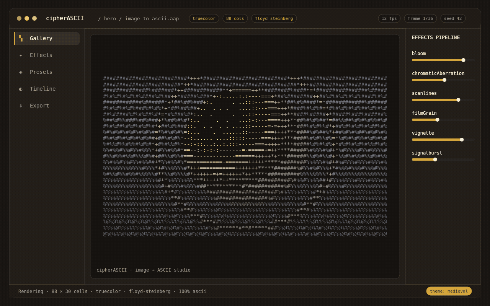
</p>

<p align="center">
  <a href="https://github.com/killerdasher/cipherASCII/releases/latest"></a>
  <a href="https://github.com/killerdasher/cipherASCII/releases/latest"></a>
  <a href="https://github.com/killerdasher/cipherASCII/releases/latest"></a>
</p>

<p align="center">
  <a href="#downloading"><strong>Download</strong></a> ·
  <a href="#getting-started">Build it</a> ·
  <a href="#features">Features</a> ·
  <a href="docs/images/pipeline.svg">How it works</a> ·
  <a href="#themes">Themes</a> ·
  <a href="CONTRIBUTING.md">Contributing</a> ·
  <a href="USER_GUIDE.md">User guide</a>
</p>

> Previously **ASCII Art Studio** - the same product, published as
> **cipherASCII**. Created by [killerdasher](https://github.com/killerdasher).

A native desktop studio for creating ASCII art: turn images and text into
character grids, edit them, apply effects, manage colour palettes, animate on a
timeline, and export to ten formats - eight text/image formats plus MP4 video
and animated GIF.

Built with React 19 + TypeScript + Vite + Tailwind CSS v3, packaged as an
Electron desktop app for **macOS, Windows and Linux**.
The rendering core (`src/core/**`) is pure TypeScript with no DOM dependency, so
every pipeline stage runs and is tested in plain Node.

<p align="center">
  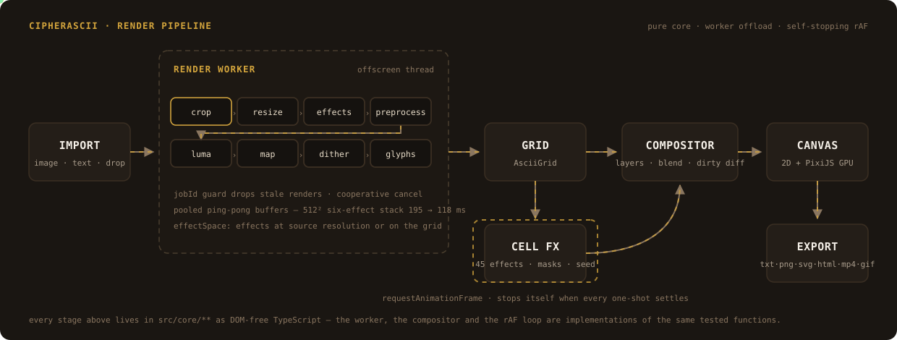
</p>

## Downloading

**No terminal needed.** Download the installer for your OS from
[Releases](https://github.com/killerdasher/cipherASCII/releases), double-click
it, click through the wizard, and launch from the desktop shortcut - the app
runs entirely offline and never executes shell commands.

| Platform | Artifact | Notes |
| --- | --- | --- |
| Windows | `cipherASCII-<version>-win-x64.exe` (NSIS installer) | Double-click → Next → done: per-user install, desktop + Start menu shortcuts |
| macOS | `cipherASCII-<version>-mac-x64.dmg`, `…-mac-arm64.dmg` (plus `.zip`) | Open the dmg, drag to Applications; unsigned build - on first launch use *Right click → Open* |
| Linux | `cipherASCII-<version>-linux-x86_64.AppImage` | `chmod +x` and run |

Installers are built by the [release workflow](.github/workflows/release.yml)
on macOS, Windows and Ubuntu for every `v*` tag and attached to the release
page above.

Every artifact is reproducible from a clean checkout with `npm run dist:mac`,
`npm run dist:win` or `npm run dist:linux`.

## Getting started

Requires Node.js 20+ (developed on Node 24) and npm 10+.

```bash
npm install
npm run dev            # browser dev server at http://localhost:5173
npm run electron:dev   # desktop app with hot reload
npm run dist           # build + package for this OS into release/
npm run dist:win       # Windows NSIS installer (run on Windows, or CI)
npm run dist:mac       # macOS dmg + zip (run on macOS, or CI)
npm run dist:linux     # Linux AppImage
npm run electron:pack  # unpacked executable only (release/win-unpacked/)
```

## Features

- **82 character sets / 3,011 unique characters** (48 of them with 16+ levels),
  all 3,011 calibrated for ink - measured glyph metrics, not guesses
- **52 dither algorithms** (error diffusion, ordered, blue-noise, halftone, pattern, edge)
- **20 raster effects** in an ordered, per-layer pipeline (bloom, diffraction
  stars, CRT curvature, chromatic aberration, scanlines, film grain, glitch,
  sharpen, blur, median, motion blur, ...) applied in the worker — at source
  resolution, or on the downscaled grid for a ~1000× cheaper render
  (`effectSpace`, Settings → Image Settings)
- **45 cell effects** that animate the *characters* after they exist — five
  signature originals (**Cipherlock**, **Hexfall**, **Glyphwave**,
  **Signalburst**, **Keyshift**) plus reveal, motion, energy, destruction and
  atmosphere families, each with typed parameter sliders, per-effect masks,
  intensity, delay and a reproducible **seed** (`docs/EFFECTS.md`)
- **Live cell-effect runtime**: one `requestAnimationFrame` loop in the editor
  that stops itself the moment every one-shot effect settles — an idle canvas
  costs nothing (`docs/RENDERING.md`)
- **Animation core**: 26 easings, frame-time tweens with delay/repeat/pingPong
  and seam-free sequencing, motion paths with arc-length parameterisation, and
  a scene system with triggers and transition handover (`docs/ANIMATION.md`)
- **Layered rendering**: interned glyphs, structure-of-arrays planes, a
  z-ordered compositor with blend modes and standard alpha, and a dirty-region
  diff that picks `none`/`diff`/`full` per frame
- **Command palette** (`Ctrl+K`): every panel, tool, toggle, quality mode,
  theme and all 45 cell effects, ranked by a tested matcher
- **Adaptive performance**: Auto/Balanced/Low quality modes driven by a
  frame-time controller (hysteresis + cooldown), plus a debug overlay with
  FPS, frame time, tier and render stats (`docs/PERFORMANCE.md`)
- **10 tone-mapping strategies** (luminance, brightness, contrast, local contrast, edge,
  detail-aware content mapping driven by per-cell contrast/edge/texture, ...)
- **10 export formats**: TXT, ASC, ANSI, JSON, HTML, SVG, AAP, PNG, **MP4**, **GIF**
- **10 themes**: Medieval, Dither Boy, Terminal Green, Terminal Amber, Light,
  High Contrast, plus the four cipher themes - **Gothic Medieval**, **Cyber Y2K**,
  **Cozy Cafe French**, **Zelda / RPG**
- **Tailwind CSS v3** utilities bound to the theme's CSS variables, so a theme
  swap recolours every new component at once
- **Calibrated glyph metrics** (`src/core/glyph/`): `npm run calibrate`
  measures every preset character (ink, bounding box, density, edge ratio,
  symmetry) into a committed table; the ramp sorts by that measured ink
  (button or render-time **Order by measured ink**) and says how many
  characters fell back to the coverage table
- **Canvas drawing tools**: **select** (drag a rectangle, click to grab a
  region; brush, fill and the clipboard honour it), brush, eraser, flood
  fill, **text** (type straight onto the canvas with a floating input, Enter
  places / Esc cancels), character **and colour** picker, and pan (one undo
  step per stroke); cut/copy/paste the selection with `Ctrl+X`/`C`/`V`,
  `Delete` clears the selected cells, `Esc` deselects
- **Launch ratio picker**: the New Project dialog opens at launch with
  platform preset cards - TikTok/Reels, Instagram portrait & story, web
  banner 720x300, ad leaderboard 728x90, YouTube thumbnail, X post - each
  showing its exact snapped cell grid
- **Auto glyph analyzer**: imports (or `Ctrl+K` "Recommend charset & dither")
  score every charset x dither pairing against the actual image - perceptual
  fidelity, banding relief, ladder utilisation - and offer the top picks as
  one-click suggestion chips
- **Auto levels**: one click stretches the image's 2nd..98th luminance
  percentiles onto the full range so the glyph ladder is used decisively
- **Import auto-size**: a dropped picture sizes the grid to itself (8px cells,
  so `columns = width / 8` and the ASCII covers the same footprint)
- **Display polish**: **CRT** bloom toggle on the editor canvas (display only),
  plus two ramp sorts - heuristic coverage and canvas measurement
- **Canvas presets**: TikTok/Reels, Instagram portrait & story, wide banner,
  web banner, leaderboard, HD, YouTube thumbnail and X post artboard sizes
  that snap to the 8 x 16 cell grid (Settings > Canvas and New Project)
- **GPU preview**: an optional **PixiJS 8 / WebGL** viewport (toolbar **GPU**)
  with a real CRT shader - barrel curvature, scanlines, glow, vignette -
  falling back to the 2D canvas automatically when WebGL is unavailable
- **Sampling engine**: selectable **luminance standard** (BT.601, BT.709, NTSC
  luma, average, sRGB linear), five resize filters including **Lanczos 3**, and
  per-cell supersampling - the *Sampling* section of the ASCII dock
- **Subtexture masks**: scanlines, RGB aperture stripes, phosphor rosettes and
  grid overlays in the same pixel space as the art, applied to the editor
  preview *and* the exported PNG (Settings > Canvas)
- **Branding**: `<CipherAsciiLogo />` SVG mark and a *Created by killerdasher*
  credit in the Settings pane
- **Native application menu** (File / Edit / View / Help) wired to the same
  actions as the toolbar

## Status

Implemented and covered by the test suite:

| Area | State |
| --- | --- |
| Image -> ASCII pipeline (decode, crop, resize, preprocess, dither, map, grid) | working |
| Text -> ASCII banner rendering (5 bitmap fonts, 6 styles) | working |
| Grid editor, layers, composition, undo/redo (immutable history) | working |
| Canvas drawing: brush, eraser, flood fill, colour picker, pan | working |
| Effects pipeline (20 effects, applied in the worker, reorderable) | working |
| Sampling: luminance standards (BT.601/709, sRGB linear), 5 resize filters incl. Lanczos 3, supersampling | working |
| Subtexture masks (scanlines, RGB stripes, rosettes, grid) on preview + PNG | working |
| Canvas presets (TikTok / square / wide / HD) snapped to the 8 x 16 cell grid | working |
| PixiJS GPU preview: WebGL viewport + CRT shader, automatic 2D fallback | working |
| Palettes, including **Auto Palette** (5 dominant colours of the source image) | working |
| Timeline: tracks, keyframes (add/remove on the track), playhead, click-to-seek, transport playback; saved with the project as undoable document edits | working |
| Themes: 10 presets (6 original + Gothic / Cyber Y2K / Cafe / Zelda), canvas included | working |
| Tailwind v3 utilities layered over the theme's CSS variables | working |
| View state: zoom, grid overlay, CRT bloom toggle | working |
| Panels: shared styled slider, WAI-ARIA tabbed docks, Framer Motion transitions | working |
| Branding: cipherASCII logo, About dialog and Settings credit | working |
| Export: TXT / ASC / ANSI / JSON / HTML / SVG / AAP / **PNG** / **MP4** / **GIF** | working |
| Video export: every timeline frame rasterised and encoded with **ffmpeg.wasm** (H.264 MP4, single-pass palette GIF), progress bar in the Export panel | working |
| Unified export frame renderer: one composed stack + timeline frame + cell-effect bake feeds PNG, text, HTML/SVG/JSON and every video frame | working |
| Worker rendering with generation IDs (stale results are dropped) + stage progress in the status bar | working |
| Worker pool: up to 4 slots; image analysis + generative-layer graphs run off-thread (single-flight, epoch-guarded replies) | working |
| Stale-render settlement (`StaleRenderError`) + 60 ms render debounce | working |
| Cell-effect engine: 45 effects, masks, pipeline, seeded determinism | working |
| Live cell-effect playback in the editor (self-stopping rAF loop) | working |
| Layered canvas core: glyph interning, planes, compositor, dirty diff | working |
| Generative layer: seeded node-graph fields (noise, gradient, threshold, combine) mapped to glyphs, edited in the **Gen** dock | working |
| Animation core: 26 easings, tweens, sequences, motion paths, scenes | working |
| Signature demo + golden-frame visual regression (`npm run demo`) | working |
| Command palette (Ctrl+K) with tested ranking + registry-driven sections | working |
| Quality modes + adaptive controller + debug overlay (Settings > Performance) | working |
| Visual-golden fixtures (banner, blue-noise render, signature fx) + determinism | working |
| Effect space: raster effects at source resolution **or** on the downscaled grid (Settings → Image Settings) | working |
| Glyph/compositor/colour review: overflow, allocation-free ordering, ANSI-256 fix | working |
| Benchmarks: `npm run bench` and `npm run bench:engines` with published numbers | working |
| Drag-and-drop import of PNG, JPEG, WEBP, BMP, GIF (auto-sized grid) | working |
| Cross-platform packaging (macOS dmg/zip, Windows NSIS, Linux AppImage, app icon) | working |

**Not implemented yet** (stated honestly rather than faked):

- No WebGL **text-glyph** renderer: the optional **GPU preview** (toolbar
  *GPU*) draws the already-rasterised editor canvas through PixiJS 8 with a
  CRT shader, but painting and glyph layout stay on the 2D canvas. No video
  **import** (no MP4/WebM in); MP4/GIF **export** runs through `@ffmpeg/ffmpeg`
  with the `@ffmpeg/core` WASM build (H.264 + GIF, vendored to `public/ffmpeg/`
  by `scripts/prepare-ffmpeg-core.mjs`, served over http in dev or through the
  `fs:readAsset` bridge from `file://`).
- Tailwind CSS v3 is wired (components + utilities layers, **preflight off** so
  the hand-written CSS keeps authority); Framer Motion 14 drives the dock panel
  transitions (short fade/slide, neutralised under `prefers-reduced-motion`).
- The stack's "bloom" and "CRT curvature" items are **core image effects**
  (raster, applied in the worker), not a real-time shader. The toolbar **CRT**
  button adds a display-only bloom on the editor canvas (a 2D self-composite,
  not WebGL).
- No `@ts-nocheck` anywhere: the four files that used to carry one
  (`effects/pipeline.ts`, `palette/palette.ts`, `timeline/timeline.ts`,
  `TimelinePanel.tsx`) type-check clean under `strict` on their own.
- Lint runs clean (`npm run lint`), but `noUnusedLocals` means the config
  keeps `no-explicit-any` and `exhaustive-deps` off to match the existing
  style.

## Themes

Ten presets, rendered through the real pipeline (`npm run screenshots`
regenerates every image below - no mockups):

<table>
  <tr>
    <td align="center">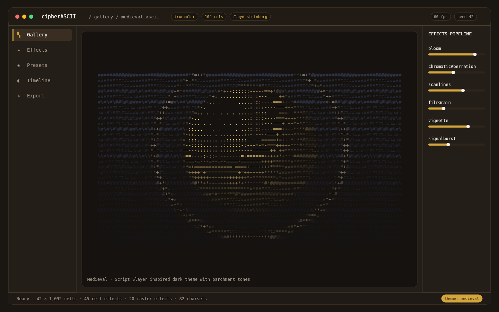<br><sub><b>Medieval</b></sub></td>
    <td align="center">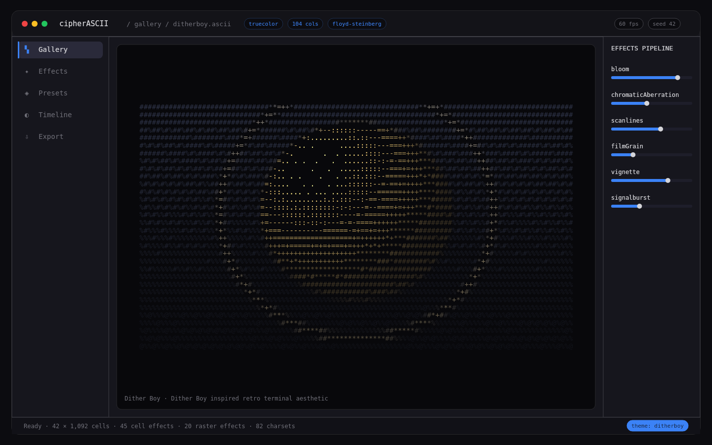<br><sub><b>Dither Boy</b></sub></td>
  </tr>
  <tr>
    <td align="center">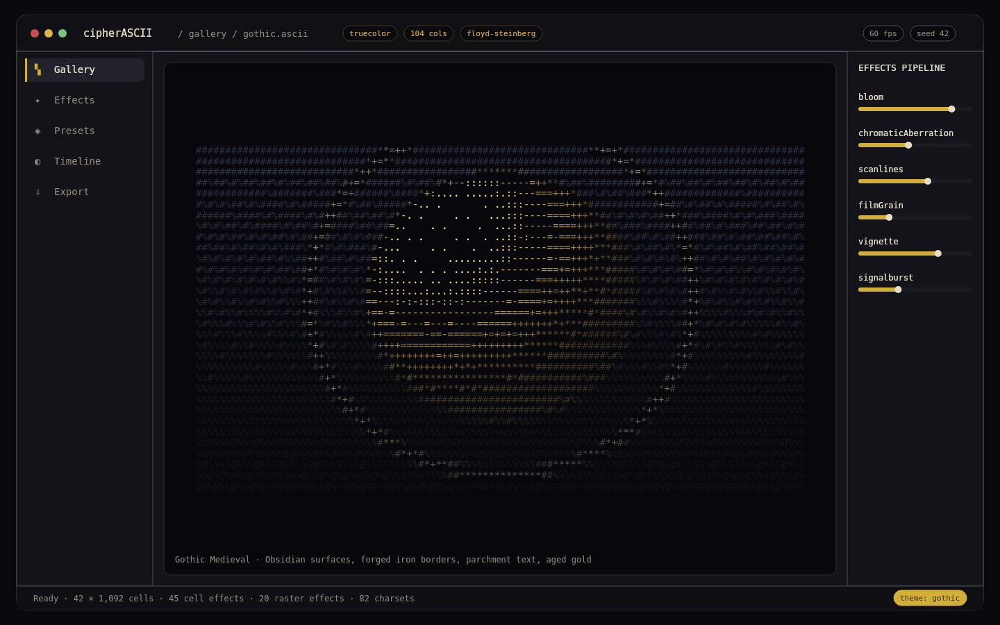<br><sub><b>Gothic</b></sub></td>
    <td align="center">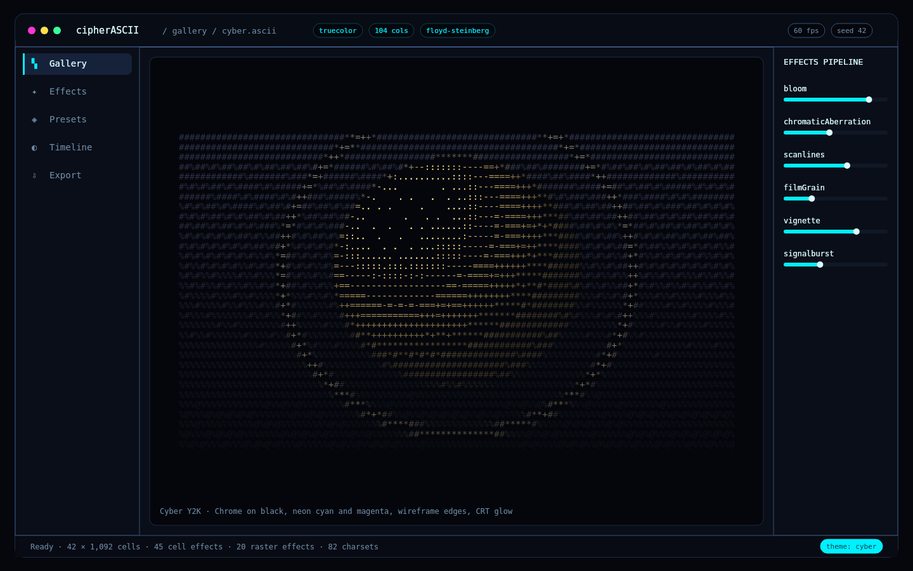<br><sub><b>Cyber Y2K</b></sub></td>
  </tr>
  <tr>
    <td align="center">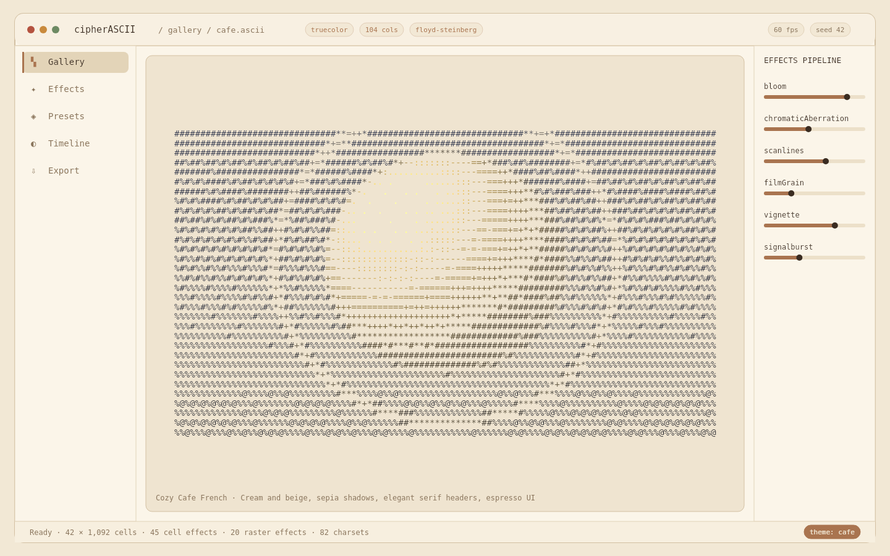<br><sub><b>Cafe</b></sub></td>
    <td align="center">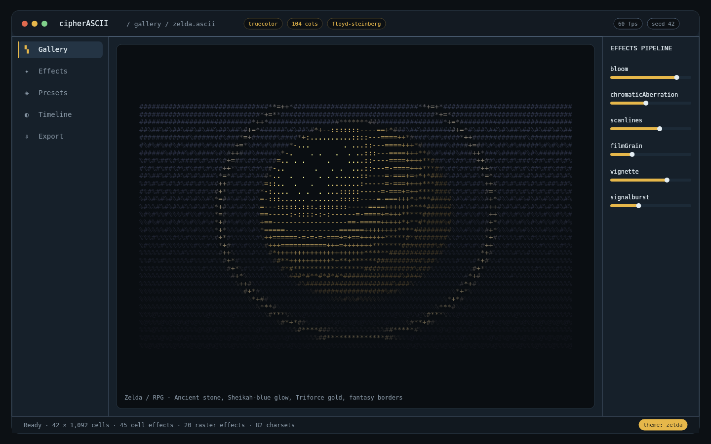<br><sub><b>Zelda</b></sub></td>
  </tr>
  <tr>
    <td align="center">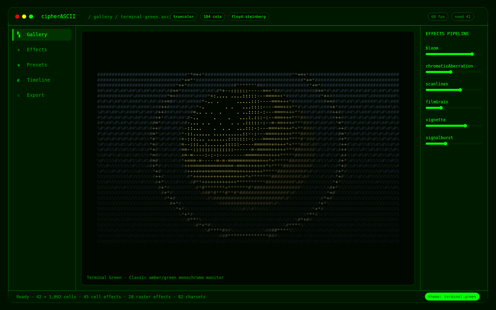<br><sub><b>Terminal Green</b></sub></td>
    <td align="center">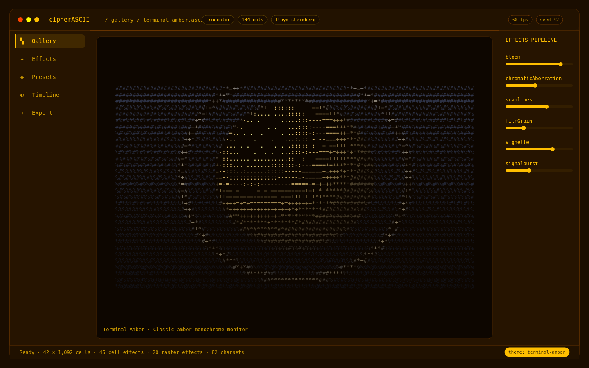<br><sub><b>Terminal Amber</b></sub></td>
  </tr>
  <tr>
    <td align="center">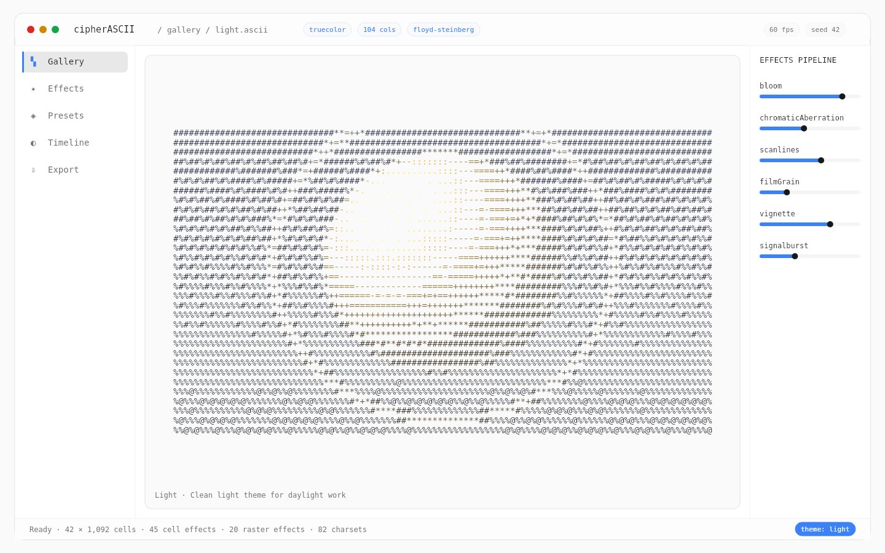<br><sub><b>Light</b></sub></td>
    <td align="center">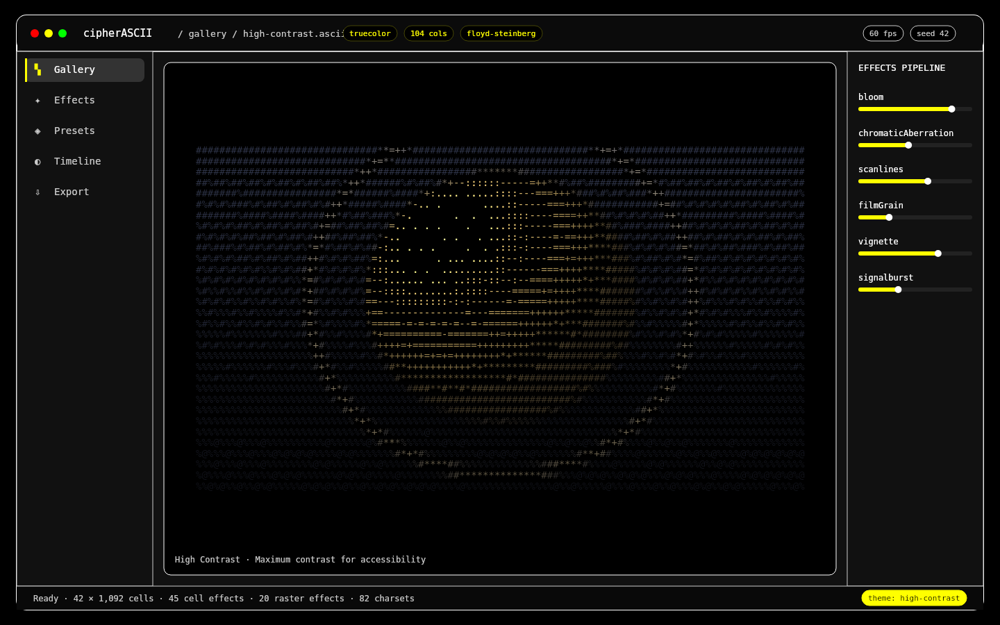<br><sub><b>High Contrast</b></sub></td>
  </tr>
</table>

More screens: [docs/screenshots/](docs/screenshots/) and the animated hero
GIF's poster frame [docs/images/hero.png](docs/images/hero.png).

## Scripts

| Script | Purpose |
| --- | --- |
| `npm run dev` | Vite dev server (browser) |
| `npm run build` | Typecheck + production bundle into `dist/` |
| `npm run typecheck` | `tsc --noEmit` |
| `npm run lint` | ESLint flat config (`@typescript-eslint`, React hooks) |
| `npm test` | Full unit + fuzz suite (`vitest run`) |
| `npm run test:watch` | Watch mode |
| `npm run test:coverage` | Coverage over `src/core/**` |
| `npm run fuzz` | Property tests only (`tests/fuzz`) |
| `npm run bench` | Render / text / dither throughput tables |
| `npm run bench:engines` | Cell effects, bridge, compositor/diff, tween and stroke ratios |
| `npm run demo` | Signature animation demo; `DEMO_SEED=7` / `NO_COLOR=1` / `UPDATE_GOLDEN=1` |
| `npm run calibrate` | Re-measure every preset glyph into `src/core/glyph/calibrationTable.ts` |
| `npm run simulations` | Dither fidelity, palette recovery, generation protocol, charset stats |
| `npm run screenshots` | Regenerate `docs/screenshots/theme-*.png` (one per theme) |
| `npm run hero` | Regenerate `docs/images/hero.gif` + poster; `NO_ENCODE=1` for frames only |
| `npm run icons` | Regenerate `public/icon.*` (icns/ico/png) from the brand mark |
| `npm run build:electron` | Compile `electron/main.ts` |
| `npm run electron:dev` | Desktop app in dev mode |
| `npm run electron:build` | Full package (installer + unpacked) |
| `npm run electron:pack` | Unpacked executable only |
| `npm run electron:preview` | Run the compiled Electron shell against `dist/` |
| `npm run dist` / `dist:mac` / `dist:win` / `dist:linux` | electron-builder for the current or a named OS |

`bench`, `bench:engines`, `simulations`, `demo`, `screenshots` and `hero` run
through Vitest (`vitest.scripts.config.ts`) because the project uses
extensionless TypeScript imports, which plain `node --experimental-strip-types`
cannot resolve.

## Keyboard shortcuts

| Shortcut | Action |
| --- | --- |
| `Ctrl+N` | New document |
| `Ctrl+O` | Open project |
| `Ctrl+S` | Save project (`.aap` or `.json`) when there are unsaved changes |
| `Ctrl+K` | Command palette (every panel, tool, toggle, effect and theme) |
| `Ctrl+Z` / `Ctrl+Shift+Z` | Undo / redo |
| `Ctrl+T` | Left dock: Timeline |
| `Ctrl+P` | Right dock: Palette |
| `Ctrl+E` | Right dock: Effects |
| `Space` | Toggle the terminal preview |
| `S` / `B` / `E` / `F` / `I` / `H` | Select / Brush / Eraser / Fill / Pick / Pan |
| `Ctrl+C` / `Ctrl+X` / `Ctrl+V` | Copy / cut / paste the selection (undoable) |
| `Delete` / `Esc` | Clear the selected cells / drop the selection |

## Project layout

```
electron/            Electron main process, window, smoke-test probes
src/core/            Pure rendering core - never imports UI code
  canvas/            Glyph interning, planes, compositor, dirty diff, virtual canvas
  animation/         26 easings, tweens, sequences, animator
  motion/            Path sampling (arc length) + body physics
  scene/             Scene timeline, triggers, scene director
  particles/         Pooled particle system (no per-frame allocation)
  fx/                45 cell effects, mask compiler, pipeline, runtime bridge
  analysis/          Image analysis: fields, saliency, regions, cached pipeline
  charsets/          82 character sets, 3,011 unique characters
  glyph/             Glyph features, index, committed calibration table
  dither.ts          52 dither algorithms
  mapping.ts         10 tone-mapping strategies + charset presets
  effects/           20-effect raster pipeline
  text/              Bitmap fonts, FIGlet, banner styles
  palette/           Palette model, extraction, import/export
  timeline/          Tracks, keyframes, interpolation, playback helpers
  export/            8 exporters behind one registry + video arg builders
  project/           Project schema + serialization (incl. cell-effect stack)
  theme/             10 app themes
docs/              Architecture audit + rendering/animation/effects/perf guides
docs/images/       Hero GIF, poster frame, animated pipeline graph
docs/screenshots/  One rendered preview per theme (npm run screenshots)
scripts/           Bench, simulations, signature demo, gallery/hero/icon generators
scripts/lib/       Shared drawing helpers for the generators (excluded from vitest)
src/worker/        Pooled Web Worker host (render/decode/analysis/creative, generation IDs)
src/services/      Renderer-side ffmpeg.wasm video export
src/components/    React panels (left/right docks, canvas, modals)
src/store/         Zustand store (project, view, ui, settings)
tests/unit/        Unit tests
tests/fuzz/        Property tests (fixed seeds, reproducible)
.github/workflows/ CI (typecheck/lint/test/build) + cross-platform release
```

## Verification

The repo is kept green:

```bash
npm run typecheck                 # 0 errors (renderer + electron)
npm run lint                      # 0 errors (ESLint flat config)
npm test                          # 1134 tests / 61 files, ~10 s
npm run demo                      # signature animation demo (golden-checked)
npm run calibrate                 # regenerate the glyph calibration table
npm run bench                     # render / text / dither throughput tables
npm run bench:engines             # effect, compositor, stroke ratios
npm run simulations               # algorithm simulations
npm run screenshots               # rebuild docs/screenshots (visual assets)
npm run hero                      # rebuild docs/images/hero.gif (visual assets)
npm run electron:build            # full package (CI also builds mac + win)
```

Visual regression lives in `tests/golden/` (text banner, blue-noise image
render, one frame per signature effect at seed 42). After an intentional
change, rewrite and commit them:

```bash
UPDATE_GOLDEN=1 npx vitest run tests/unit/golden.test.ts
```

Measured numbers, with the commands that produced them, live in
[docs/PERFORMANCE.md](docs/PERFORMANCE.md).

## Architecture

See [ARCHITECTURE.md](ARCHITECTURE.md) for the data flow, threading model,
command/history design and extension points (registry-based dither, effects,
mapping strategies and exporters).

Topic guides written against the current code:

| Doc | Covers |
| --- | --- |
| [docs/ARCHITECTURE_AUDIT.md](docs/ARCHITECTURE_AUDIT.md) | What was wrong before this pass, with `file:line` evidence |
| [docs/RENDERING.md](docs/RENDERING.md) | Grid → worker → compositor → canvas data flow, generation guards |
| [docs/ANIMATION.md](docs/ANIMATION.md) | Easing, tweens, sequencing, motion paths, scenes |
| [docs/EFFECTS.md](docs/EFFECTS.md) | The 45 cell effects, masks, lifecycle, how to add one |
| [docs/THEMES.md](docs/THEMES.md) | The ten themes, roles, CSS variable injection |
| [docs/PERFORMANCE.md](docs/PERFORMANCE.md) | Measured numbers, what changed, what is still open |

Contributing: see [CONTRIBUTING.md](CONTRIBUTING.md).
Usage: see [USER_GUIDE.md](USER_GUIDE.md).
Security reports: see [SECURITY.md](SECURITY.md) - report privately, never as
a public issue.

## License

MIT - see [LICENSE](LICENSE).
